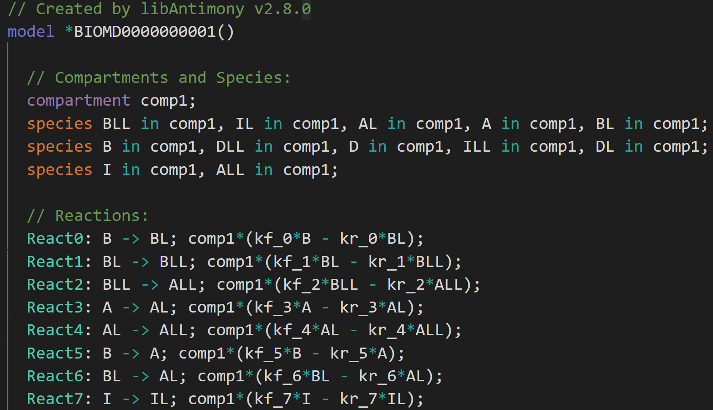
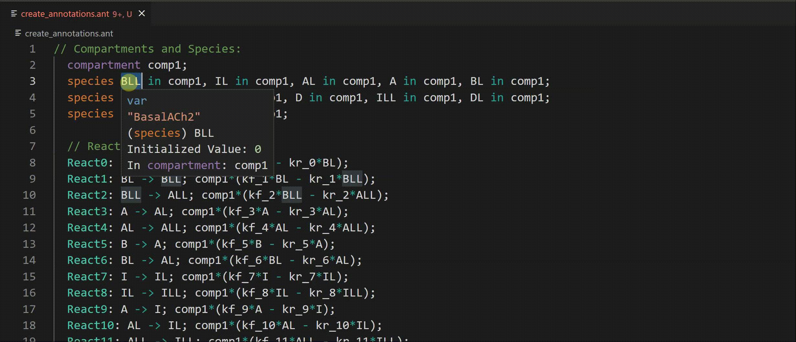

# Antimony for Visual Studio Code

#### [Repository](https://github.com/sys-bio/vscode-antimony/tree/master/vscode-antimony)&nbsp;&nbsp;|&nbsp;&nbsp;[Issues](https://github.com/sys-bio/vscode-antimony/issues)&nbsp;&nbsp;|&nbsp;&nbsp;[Code Examples](https://github.com/sys-bio/vscode-antimony/tree/master/examples)&nbsp;&nbsp;|&nbsp;&nbsp;[Antimony Reference](https://tellurium.readthedocs.io/en/latest/antimony.html)&nbsp;&nbsp;|&nbsp;&nbsp;[tellurium](https://tellurium.readthedocs.io/en/latest/index.html)&nbsp;&nbsp;|&nbsp;&nbsp;[Marketplace Link](https://github.com/microsoft/vscode-cpptools/releases)&nbsp;&nbsp;|&nbsp;&nbsp;[Marketplace Link for Extension Pack](https://marketplace.visualstudio.com/items?itemName=stevem.antimony-extension-pack)

The Antimony extension adds language support for Antimony to Visual Studio Code for building models in Systems Biology.

The currently available version 0.1 is a public beta version developed by [Gary Geng](https://www.linkedin.com/in/gary-geng-9995a2160/), [Steve Ma](https://www.linkedin.com/in/steve-ma/), and Dr. [Joseph Hellerstein](https://sites.google.com/uw.edu/joseph-hellerstein/home?authuser=0) at the University of Washington. Steve Ma is responsible for future releases, and please feel free to [contact](mailto:bochenma@cs.washington.edu) him if you have any questions.

Please note that the current release does not support the complete Antimony grammar. While most grammar has been supported, more will be included in future releases.

## Features
The extension provides many convenient features for developing biological models with the Antimony language in tellurium. The current release focuses on the areas below.

### 1. Syntax recognition and highlights.

 
<em>(Syntax Highlights)</em>

⚠️ Note: the default syntax highlighting for Antimony is provided by a separate extension [Antimony Syntax](https://marketplace.visualstudio.com/items?itemName=stevem.vscode-antimony-syntax), and is also available in the [Antimony Extension Pack](https://marketplace.visualstudio.com/items?itemName=stevem.antimony-extension-pack) 

### 2. Automatic annotation creation with ChEBI and UniProt

 
<em>(Syntax Highlights)</em>

## Requirements

## Extension Settings

## Known Issues

## Release Notes

### 1.0.0