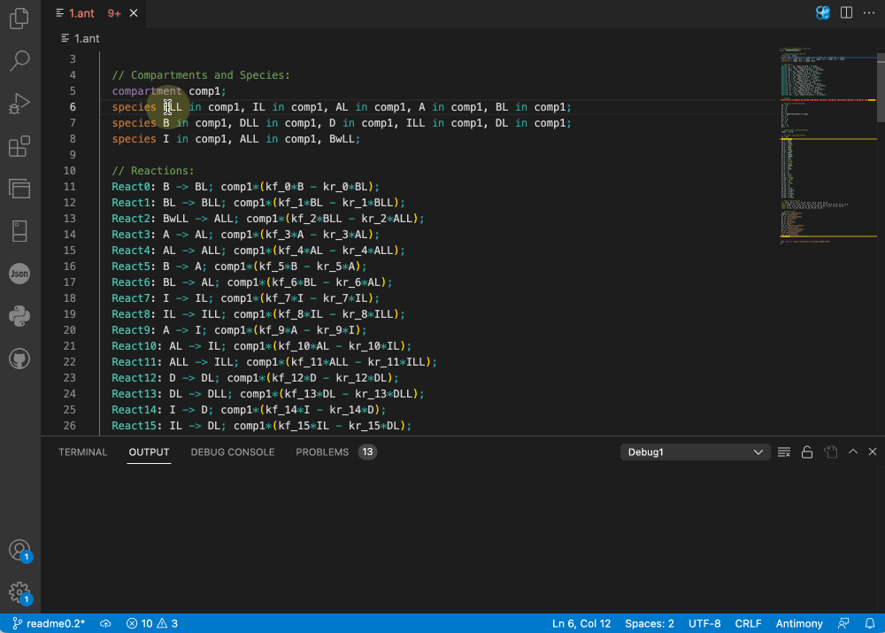
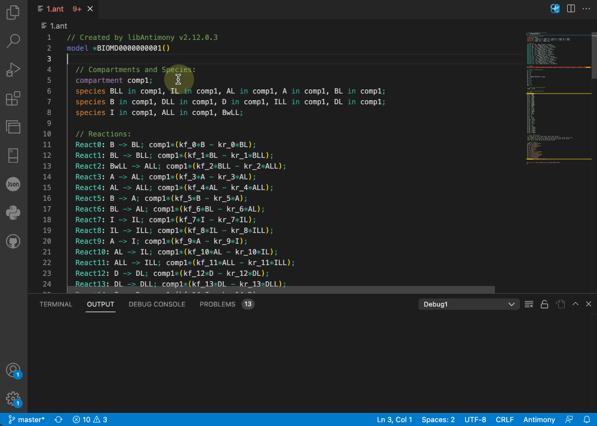
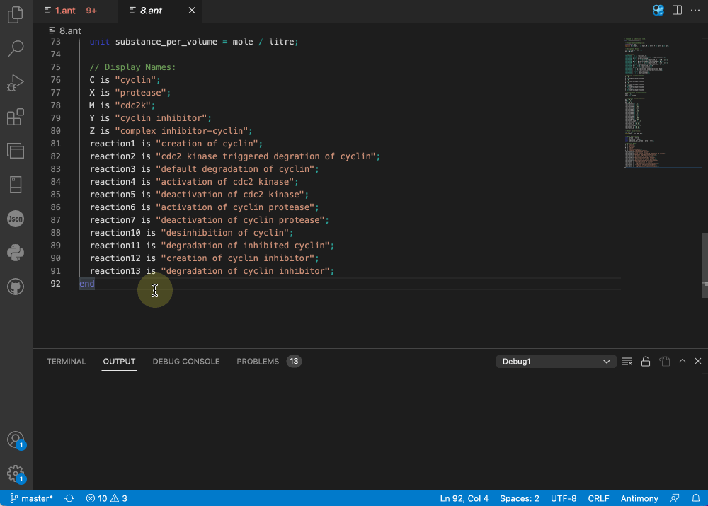
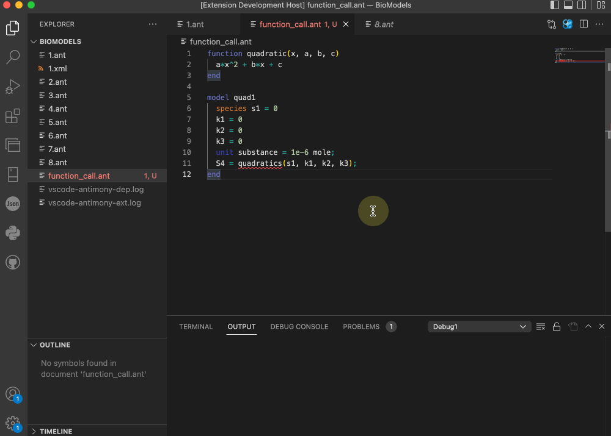
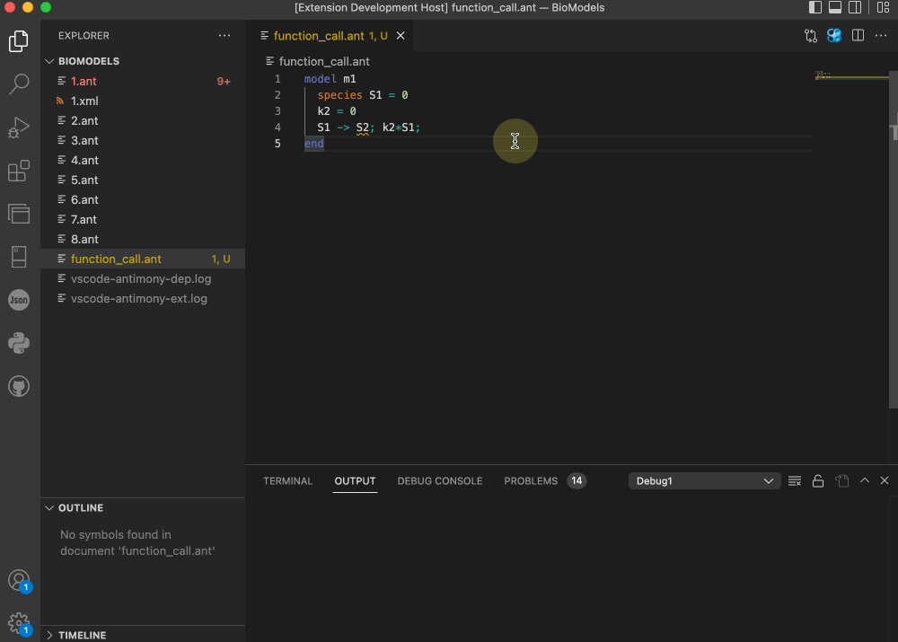
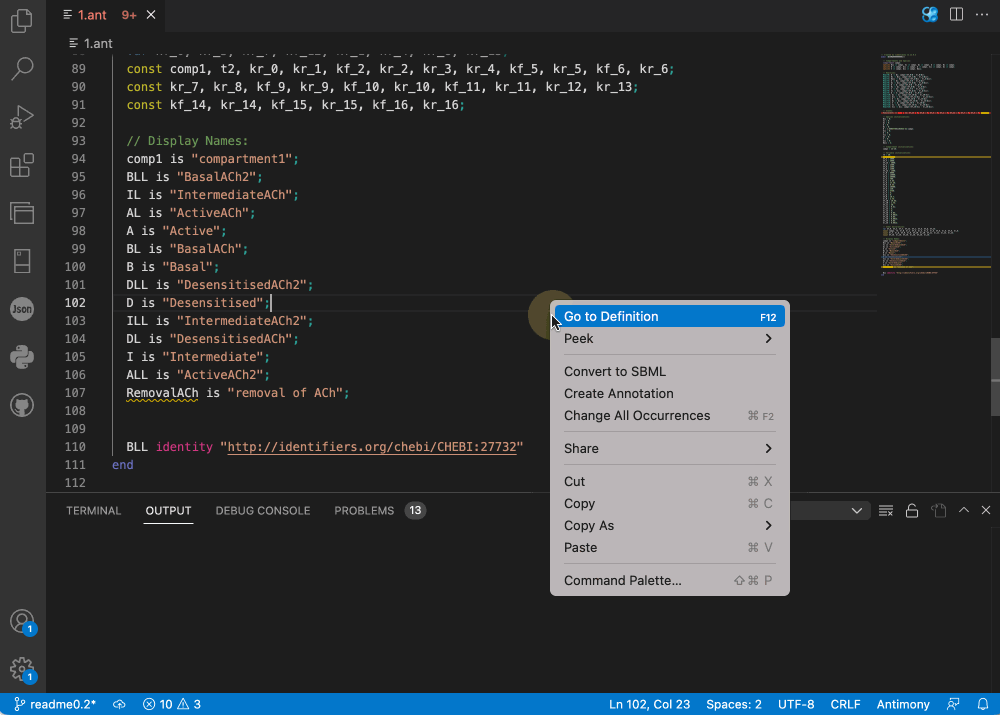
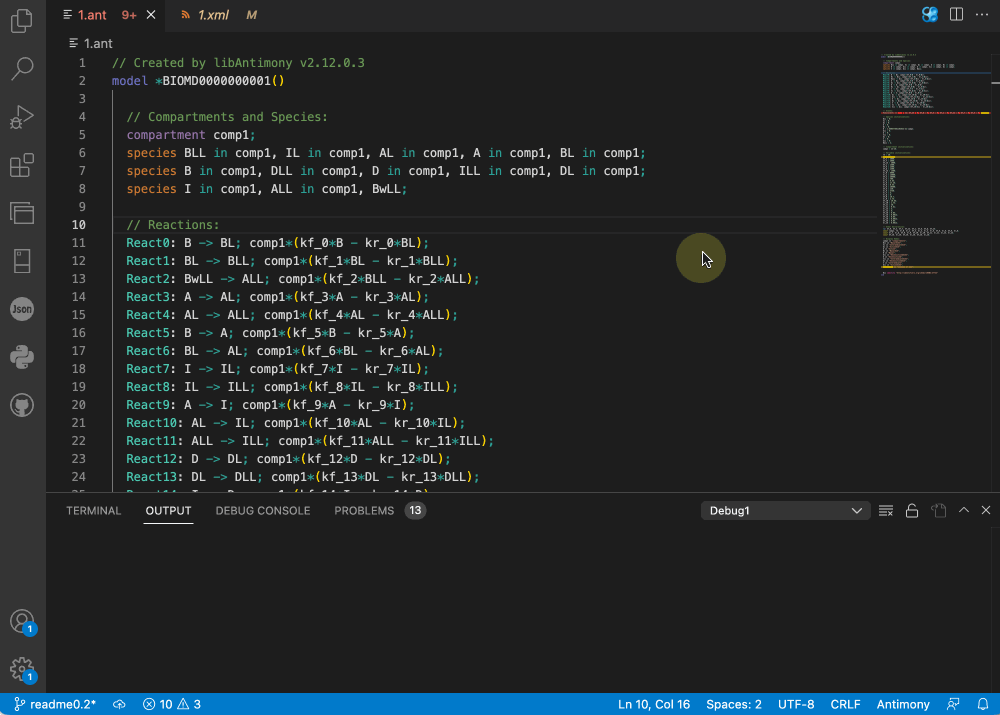
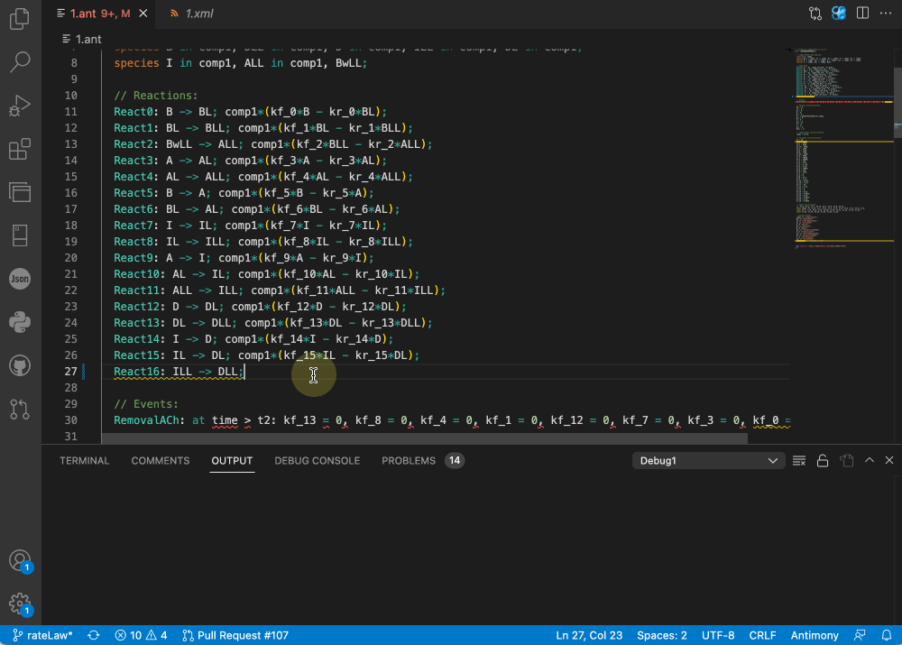
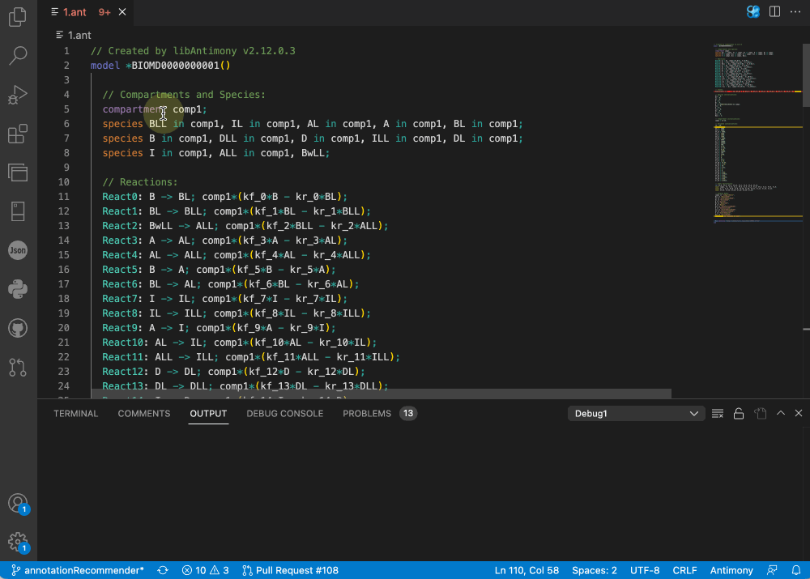

# Antimony for Visual Studio Code

#### [Repository](https://github.com/sys-bio/vscode-antimony/tree/master/vscode-antimony)&nbsp;&nbsp;|&nbsp;&nbsp;[Issues](https://github.com/sys-bio/vscode-antimony/issues)&nbsp;&nbsp;|&nbsp;&nbsp;[Code Examples](https://github.com/sys-bio/vscode-antimony/tree/master/examples)&nbsp;&nbsp;|&nbsp;&nbsp;[Antimony Reference](https://tellurium.readthedocs.io/en/latest/antimony.html)&nbsp;&nbsp;|&nbsp;&nbsp;[tellurium](https://tellurium.readthedocs.io/en/latest/index.html)&nbsp;&nbsp;|&nbsp;&nbsp;[Marketplace Link](https://marketplace.visualstudio.com/items?itemName=stevem.vscode-antimony)&nbsp;&nbsp;|&nbsp;&nbsp;[Marketplace Link for Extension Pack](https://marketplace.visualstudio.com/items?itemName=stevem.antimony-extension-pack)

The Antimony extension adds language support for Antimony to Visual Studio Code for building models in Systems Biology.

The currently available version 0.2 is a public beta version developed by [Longxuan Fan](https://www.linkedin.com/in/longxf), [Sai Anish Konanki](https://www.linkedin.com/in/anish-konanki-8b81a575/), [Eva Liu](https://www.linkedin.com/in/evaliu02), [Steve Ma](https://www.linkedin.com/in/steve-ma/), [Gary Geng](https://www.linkedin.com/in/gary-geng-9995a2160/), [Dr. Joseph Hellerstein](https://sites.google.com/uw.edu/joseph-hellerstein/home?authuser=0), and [Dr. Herbert Sauro](https://bioe.uw.edu/portfolio-items/sauro/) at the University of Washington. Dr. Joseph Hellerstein is responsible for future releases, and please feel free to [contact](mailto:joseph.hellerstein@gmail.com) him if you have any questions.

Please note that the current release does not support the complete Antimony grammar. While most grammar has been supported, more will be included in future releases.

## Installation
The Antimony extension pack includes two extensions: [Antimony](https://marketplace.visualstudio.com/items?itemName=stevem.vscode-antimony) and [Antimony Syntax](https://marketplace.visualstudio.com/items?itemName=stevem.vscode-antimony-syntax) for the color scheme. The [Antimony Extension Pack](https://marketplace.visualstudio.com/items?itemName=stevem.antimony-extension-pack) is also available on the Visual Studio Code Marketplace. We recommend installing the extension pack directly so you have full access to all of the features. For installation, simply download the extension pack from the Visual Studio Code Marketplace and install.

## Features
The extension provides many convenient features for developing biological models with the Antimony language in tellurium. The current release focuses on the areas below.

### 1. Syntax recognition and highlights

 
<em>(Syntax Highlights)</em>

⚠️ Note: the default syntax highlighting for Antimony is provided by a separate extension [Antimony Syntax](https://marketplace.visualstudio.com/items?itemName=stevem.vscode-antimony-syntax), and is also available in the [Antimony Extension Pack](https://marketplace.visualstudio.com/items?itemName=stevem.antimony-extension-pack) 

### 2. Automatic annotation creation with database recommendation
The extension can recognize different types of variables, and recommend databases base on the [OMEX metadata specification](https://doi.org/10.1515/jib-2021-0020).

 
<em>(Creating an annotation of species BLL through the ChEBI database)</em>

### 3. Hover messages 

 
<em>(Hovering over species to look up information)</em>

### 4. Code navigation

 
<em>(Navigating to the definition code)</em>

### 5. Error detection
The extension supports various warning and error detections to help modelers debug their model during development. Our design principle for whether an issue should be a warning or an error entirely depends on the logic of tellurium. Our extension will mark the subject as an error if tellurium throws an error while rendering the model, with a red underline. An example would be calling a function that does not exist (usually due to a typo, which is extremely common during development. Read more in my [thesis](https://drive.google.com/file/d/1FutuOYgq9Jd_AHqp_z4f2joDavVIURuz/view?usp=sharing)).

 
<em>(Typos are extremely common in software development)</em>

On the other hand, certain issues are not errors in tellurium, but we thought it would be worthwhile to have the user's attention. For example, missing initial values for species and overriding a previously defined value.

 
<em>(Forgetting to initialize the value for a species, causing tellurium to assume a default value)</em>

The extension supports a wide range of errors and warnings, and we plan to support more in the upcoming releases. Read more in [issues](https://github.com/sys-bio/vscode-antimony/issues).

### 6. Converter between Antimony and SBML

 
<em>(Exporting Antimony file in SBML format)</em>

### 7. Antimony/SBML preview

 
<em>(Previewing Antimony file as SBML)</em>

### 8. Automatic creation of rate laws

 
<em>(Creating a rate law on a reversible reaction)</em>

### 9. Annotation recommender for species

 
<em>(Creating annotation for species BLL with Annotation Recommender)</em>

## Known Issues
I have an open issue for [manually curating models](https://github.com/sys-bio/vscode-antimony/issues/26) from BioModels to test the extension. Please feel free to contribute and submit issues.
* subvariables in modular models are currently not supported and false error messages will be triggered.

## Release Notes

### 0.1.0
* First public release of the extension pack.

### 0.1.1
* Added docs and examples.
* Fixed an issue related to code navigation ([#46](https://github.com/sys-bio/vscode-antimony/issues/46)).
* Fixed an issue related to displaying hover message for annotated entities ([#47](https://github.com/sys-bio/vscode-antimony/issues/47)).

### 0.1.2
* Updated docs.

### 0.1.3
* Updated docs.

### 0.1.4
* Updated docs, included a list for updates in 0.2.

### 0.2.0
* Added grammar support and warning/error detection for rate rules, sbo and cvterms, events, flux balance constraints, interaction, and import.
* Converter between Antimony and SBML
* Antimony/SBML preview.
* More databases supported in create annotation, and database recommendations.
* Automatic creation of rate laws.
* Annotation recommender for species.

